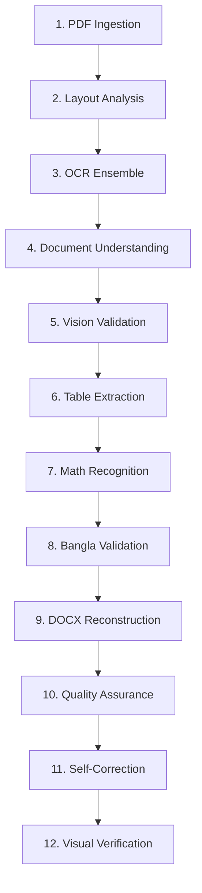

# DocRebuild AI 🚀

DocRebuild AI is a production-grade local document layout analysis and reconstruction system. It converts scanned PDFs, image-based textbooks (including NCTB curriculum books), and worksheets into highly accurate, editable Microsoft Word (`.docx`) files. 

Unlike simple OCR systems that dump plain text, DocRebuild AI **preserves complex multi-column structures, titles, images, tables, mathematical equations, and semantic reading order**.

---

## 🏗️ Pipeline Architecture

The application runs a sequential **12-stage document reconstruction pipeline** that executes entirely in-process on local hardware:



### The 12 Processing Stages:
1. **PDF Ingestion**: Renders PDF pages to high-resolution images (300 DPI) using PyMuPDF. Direct image uploads (PNG, JPG) bypass this.
2. **Layout Analysis**: Uses a custom **DocLayout-YOLOv10** model to detect structural blocks (`title`, `paragraph`, `table`, `equation`, `image`, `caption`, `list`).
3. **OCR Ensemble**: Runs specialized OCR engines (EasyOCR, Tesseract, Surya) in parallel. It maps line-level coordinates into character-length proportional word bounding boxes and groups overlapping boxes using a spatial IoU clustering threshold (>= 0.3).
4. **Document Understanding**: Extracts semantic markdown structures using lightweight local models (Docling & Marker).
5. **Vision Validation**: Cross-checks and corrects low-confidence word regions using **Florence-2**.
6. **Table Extraction**: Recovers tabular grids and formats cells using the Microsoft Table Transformer (DETR).
7. **Math Recognition**: Segments mathematical formulas and converts them to LaTeX formatting using **Pix2Tex (LaTeX OCR)**, which are then compiled directly into native Word Equation XML blocks.
8. **Bangla Validation**: Spell-checks and corrects OCR output using a dictionary and Trie spellcheck wrapper.
9. **DOCX Reconstruction**: Generates a native OpenXML document, applying margins, styles, fonts (like *Noto Sans Bengali*), alignment, and text wrapping.
10. **Quality Assurance**: Automatically grades the reconstruction by computing layout and textual similarity scores.
11. **Self-Correction**: Runs iterative correction loops on layout segments that fall below the quality threshold.
12. **Visual Verification**: Validates layout alignment using structural similarity index (SSIM) visual overlays.

---

## ⚡ Performance Optimization

DocRebuild AI is designed to run efficiently on local laptops with standard configurations:
* **No Celery/Redis Dependencies**: Rewritten to run directly in-process using Python background threads, eliminating memory overhead from external brokers.
* **Smart Language Filtering**: English-only engines (like DocTR or standard PaddleOCR) are automatically skipped for Bangla/multilingual pages. This prevents "garbage Latin shapes" from polluting Bangla text.
* **On-Demand Model Lifecycle**: Heavy neural network models are dynamically loaded into RAM/VRAM only during execution and evicted immediately after their pipeline stage finishes.
* **Dynamic Compute Device Selection**: Automatically detects and leverages CUDA acceleration if an NVIDIA GPU is available; otherwise, falls back to CPU thread pools.

---

## 📂 Project Structure

```
├── backend/                  # FastAPI Backend Server
│   ├── app/                  # REST APIs, routers, DB models, websocket handlers
│   ├── engines/              # ML Engines (OCR, Layout, Table, Vision, Math)
│   ├── reconstruction/       # OpenXML DOCX assembly logic
│   ├── workers/              # Threaded task workers & orchestrator
│   ├── data/                 # SQLite database & local storage uploads/outputs
│   └── requirements.txt      # Python dependencies
├── frontend/                 # React SPA Frontend Client
│   ├── src/                  # React components, Tailwind styling, WebSocket API
│   ├── package.json
│   └── vite.config.ts
├── docker-compose.yml        # Multi-container orchestrator
└── README.md                 # Main Documentation
```

---

## 🚀 Setup & Installation

### Native Local Setup (Recommended)

#### 1. Setup Backend
1. Navigate to the backend directory:
   ```bash
   cd backend
   ```
2. Create and activate a Python virtual environment:
   ```bash
   python -m venv venv
   # On Windows:
   venv\Scripts\activate
   # On macOS/Linux:
   source venv/bin/activate
   ```
3. Install Python dependencies:
   ```bash
   pip install -r requirements.txt
   ```
4. Copy `.env.example` to `.env` in the root workspace directory and configure paths/parameters. By default, heavy models are turned off to run comfortably on standard laptop CPUs.

#### 2. Start Backend
From the `backend` directory:
```bash
python -m app.main
```
The backend will run on `http://localhost:8000`. You can inspect endpoints via Swagger at `http://localhost:8000/docs`.

#### 3. Setup Frontend
1. Open a new terminal and navigate to the frontend directory:
   ```bash
   cd frontend
   ```
2. Install dependencies:
   ```bash
   npm install
   ```
3. Run the development server:
   ```bash
   npm run dev
   ```
Access the client dashboard at `http://localhost:5173`.

---

## 🐳 Docker Deployment

Alternatively, run the complete stack inside containers:
```bash
docker-compose up --build
```
Access the frontend on port `3000` and the API gateway on port `8000`.
